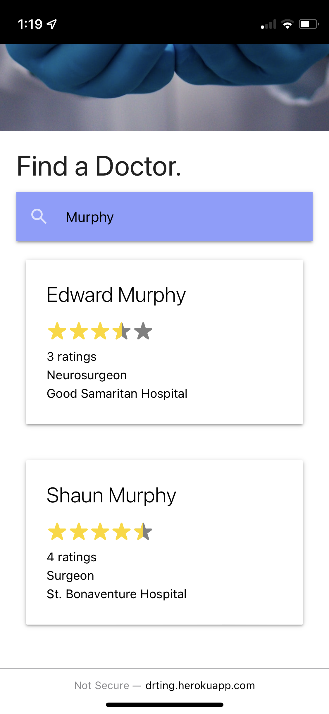
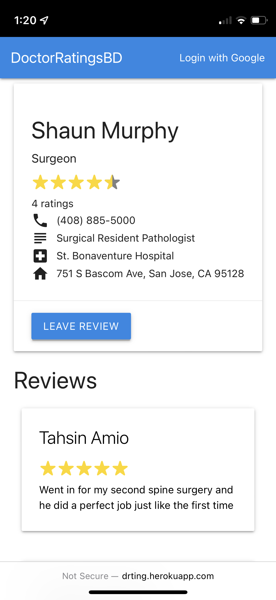

# Doctor-Rating-App

A doctor review site where users can search up local doctors and get more information on them and see others’ reviews.                                             
Created using React.js, Node.js, Mongoose, Materialize UI. App hosted in Heroku and db in MongoDB

link: http://drting.herokuapp.com                                                                                                                               
⛔  demo app not working due to heroku dropping their free tier :(

## Homepage

  

  
  

## Doctor Page

  
  

## Add Doctor Page
:closed_lock_with_key: requires admin access

  
  

